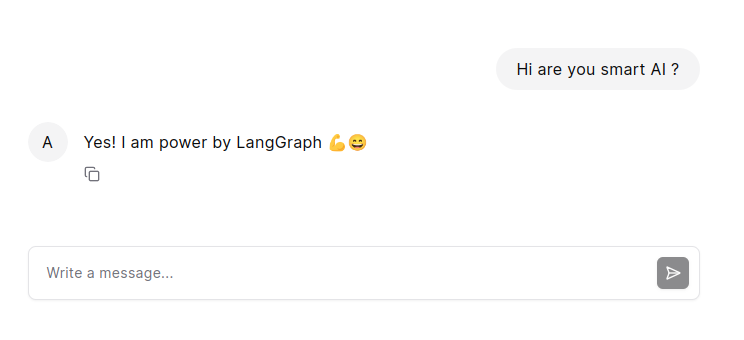

# LangGraph-UI-SDK
LangGraph user interface SDK requires only JavaScript or Typescript to have chat component connected to your server or LangGraph cloud directly.   



## Set up
Install the package
```bash
npm install langgraph-ui-sdk
```
Create HTML tag for the chat component
```html
<section id="assistant-agi"></section>
```
Import initChatBot and connect to your server
```typescript
import { initChatBot } from 'langgraph-ui-sdk'
...

initChatBot({
      containerId: "assistant-agi", // id of the HTML tag
      apiUrl: "<ADD_YOUR_API_URL>", // server url or LangGraph cloud url
      apiKey: "<ADD_API_KEY>" // optional only for local development
      configurable: { "param1": "value1" }, // LangGraph configurable parameters 
      headers: {
        'Authorization': 'Bearer <TOKEN>',
      } // your server needed headers 
    })
```

## Changing Style
You can overwrite the CSS from following file:
```
node_modules/@assistant-ui/react/styles/index.css
```

## Contributions
All welcome, feel free to create issue too.

## Credits 
Huge thanks for the developer of @assistant-ui, this small library is based on it.