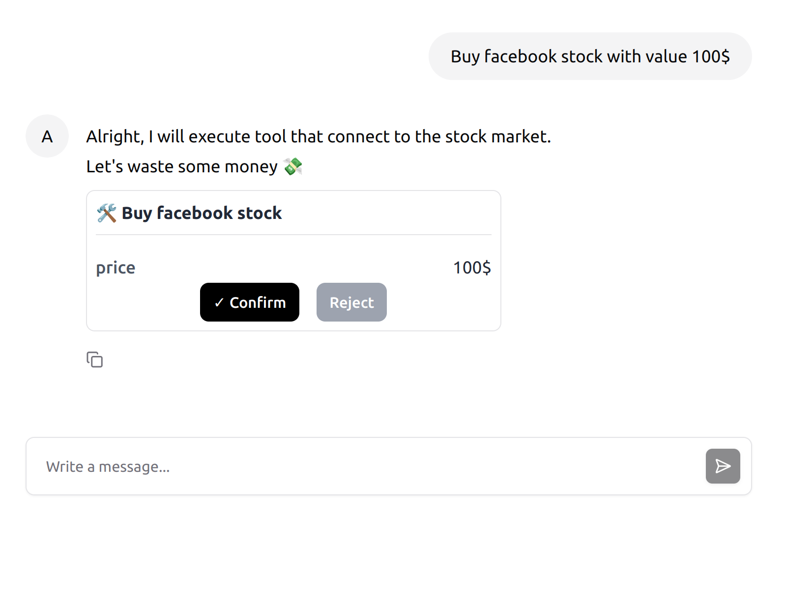

# langgraph-ui-sdk
LangGraph user interface SDK requires only JavaScript or Typescript to have chat component connected to your server or LangGraph cloud directly. the SDK is also capable of rendering tools and interacting with interrupt tools



setup can be done using npm install or CDN in HTML file directly 

## Set up using npm

Install the package
```bash
npm install langgraph-ui-sdk
```
Create HTML tag for the chat component
```html
<section id="assistant-agi"></section>
```
Import initChatBot and connect to your server
```typescript
import { initChatBot } from 'langgraph-ui-sdk'
...

initChatBot({
      containerId: "assistant-agi", // id of the HTML tag
      apiUrl: "<ADD_YOUR_API_URL>", // server url or LangGraph cloud url
      apiKey: "<ADD_API_KEY>", // optional only for local development
      configurable: { "param1": "value1" }, // LangGraph configurable parameters 
      headers: {
        'Authorization': 'Bearer <TOKEN>',
      } // your server needed headers 
      retrievalTools: [], // add tools that doesn't need confirmation to be shown in UI
      actionTools: [], // add interrupt tools
      colors: { // edit colors if needed for interrupt tools
        primary: '#000000', // default value 
        cancellation: '#9CA3AF', // default value
      },
      welcome: { // Add welcoming message and suggestions
        message: "How can I help you today?", // default 
        suggestions: [
          {
            text: "What can I do for you ?",
            prompt: "Tell me what you need help with",
          }
        ],
      }
    })
```

## Using CDN
```html
<head>
  <script src="https://cdn.jsdelivr.net/npm/langgraph-ui-sdk@0.1.1/dist/index.js"></script>
</head>

<body>
  <section id="assistant-agi"></section>
  <script>LangGraphChatbot.initChatBot({
      containerId: "assistant-agi", // id of the HTML tag
      apiUrl: "<ADD_YOUR_API_URL>", // server url or LangGraph cloud url
      apiKey: "<ADD_API_KEY>", // optional only for local development
      configurable: { "param1": "value1" }, // LangGraph configurable parameters 
      headers: {
        'Authorization': 'Bearer <TOKEN>',
      } // your server needed headers 
      retrievalTools: [], // add tools that doesn't need confirmation to be shown in UI
      actionTools: [], // add interrupt tools
      colors: { // edit colors if needed for interrupt tools
        primary: '#000000', // default value 
        cancellation: '#9CA3AF', // default value
      },
      welcome: { // Add welcoming message and suggestions
        message: "How can I help you today?", // default 
        suggestions: [
          {
            text: "What can I do for you ?",
            prompt: "Tell me what you need help with",
          }
        ],
      }
    })</script>
</body>
```

## Changing Style
You can overwrite the CSS from following file:
```
node_modules/@assistant-ui/react/styles/index.css
```

## Contributions
All welcome, feel free to create issue too.

## Credits 
Huge thanks for the developer of @assistant-ui, this small library is based on it.